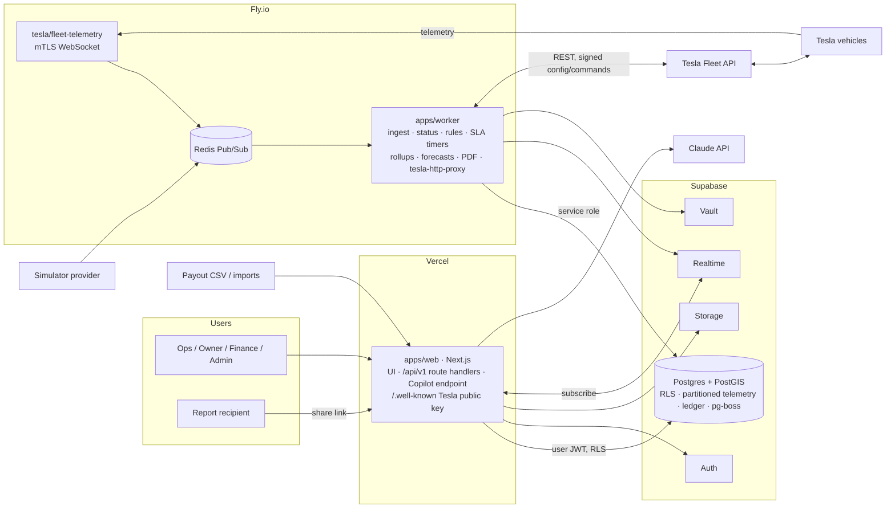

# FleetOS — Architecture

> Roadmap task 1.1 · 2026-09-26. Decisions are recorded as ADRs in [`adr/`](adr/). Requirements this architecture must satisfy: `docs/requirements/` (NFR IDs referenced below).

## 1. System context

> **Prototype stage (ADR-0014):** until a real Tesla is connected, the Fly.io box below doesn't exist. A per-minute `pg_cron` tick runs the same `packages/engine` code, the simulator feeds it directly, and live updates use Postgres Changes. The diagram shows the target from Phase 4.

## 2. Components

| Component | Responsibility | ADR |
|---|---|---|
| `apps/web` | All UI; `/api/v1` route handlers (validate with zod, call Postgres as the user); Tesla OAuth callbacks; CSV upload; Copilot endpoint; hosts the Tesla public key | 0002, 0006, 0008, 0013 |
| `apps/worker` | Long-running: telemetry consumer, normaliser, dedupe, status derivation, exception rules, pg-boss jobs (SLA timers, rollups, partitions, reports, forecasts), Realtime broadcast, Tesla REST client, `tesla-http-proxy` | 0005, 0007, 0009, 0010, 0011 |
| `tesla/fleet-telemetry` | Terminates vehicle mTLS WebSockets, publishes records to Redis | 0007 |
| `packages/engine` | Pure tick logic: provider events → live state, debounced status events, downsampled samples, alerts; provisional alert→blocking rules until task 5.4 (task 3.5) | 0007, 0014 |
| `packages/domain` | Pure TS: types, zod schemas (→ OpenAPI), status state machine, KPI calculators, rules evaluation. No I/O | 0005 |
| `packages/providers` | `VehicleProvider` interface, `SimulatorProvider`, `TeslaProvider`, contract tests | 0005 |
| `packages/ui` | Design tokens + shared components (task 1.4) | — |
| `supabase/` | SQL migrations, RLS policies, seed, pgTAP tests | 0004, 0009 |
| `prototype/` | Frozen MVP on GitHub Pages | 0003 |

## 3. Key flows

**A. Telemetry → screen (PERF-1 ≤ 15 s p95)**
1. Vehicle streams fields to `fleet-telemetry` (or the simulator publishes equivalents).
2. Record lands on Redis; the worker normalises it to a `TelemetryEvent`, drops duplicates, upserts `vehicle_state_current`, appends to today's `telemetry_samples` partition.
3. The worker re-derives status (`vehicle-states.md` precedence, 60 s debounce), writes `vehicle_status_events` on change, runs exception rules.
4. The worker broadcasts a batched state delta on `org:{id}:vehicles`; open dashboards update.

**B. Exception → dispatch → return to service**
1. A rule opens an exception (revenue at risk from `kpis.md` §3.2) → Postgres Changes → Exceptions page and bell.
2. Ops creates a ticket from it and dispatches a vendor → pg-boss schedules `sla-breach:{ticket}`.
3. Vendor arrival/complete are recorded; completion posts actual cost to `cost_lines`.
4. Return to service closes blocking items; the worker re-derives status; with `dispatch` live it would also re-enable the car on the network (preview).

**C. Tesla connection (Phase 4)**
Admin starts consent → Tesla-for-Business approves → callback exchanges `auth_code` at `fleet-auth.prd.vn.cloud.tesla.com` → tokens to Vault → roster sync → virtual-key pairing links → signed `fleet_telemetry_config` via the proxy → `synced: true` → streaming.

**D. Copilot**
User question → server route calls Claude with tools → each tool calls `/api/v1` with the user's JWT → answer with citations; actions returned as proposals the user confirms.

## 4. Environments

| Env | Web | Database | Worker / telemetry | Data |
|---|---|---|---|---|
| local | `next dev` | Supabase CLI (Docker) | worker via `tsx`, simulator only | seeded demo org |
| preview | Vercel preview per push | Supabase preview branch *or* shared staging project (decide in 2.3) | staging worker on Fly | demo org |
| production | Vercel production | Supabase production project | Fly production apps | real orgs + demo org |

## 5. How NFRs map to the design

| NFR | Where it's satisfied |
|---|---|
| TEN-1..6 isolation | RLS on all tenant tables, user-JWT access from web, org-scoped Storage and Realtime (ADR-0004, 0011) |
| SEC-3 Tesla secrets | Vault, worker-only access (ADR-0008) |
| PERF-1 freshness | streaming + broadcast path (ADR-0007, 0011) |
| PERF-3 latency | reads from `vehicle_state_current` and rollups, indexes leading with `org_id` (ADR-0009) |
| REL-3 idempotent ingest | dedupe key (vehicle, field, event time) in the worker |
| REL-6 durable timers | pg-boss (ADR-0010) |
| RET retention | daily partitions dropped after 30 days (ADR-0009) |
| OBS-4 Tesla spend | worker meters every billed Tesla call per org |
| MNT-4 substitutes | `SUBSTITUTE(...)` markers + `pnpm substitutes` (ADR-0012) |

## 6. ADR index

| # | Decision |
|---|---|
| [0001](adr/0001-record-architecture-decisions.md) | Record architecture decisions |
| [0002](adr/0002-stack-nextjs-supabase-fly-worker.md) | Next.js on Vercel + Supabase + worker on Fly.io |
| [0003](adr/0003-monorepo-layout-and-trunk-based-workflow.md) | Monorepo layout and trunk-based workflow |
| [0004](adr/0004-multi-tenancy-org-id-rls.md) | Multi-tenancy with `org_id` + RLS |
| [0005](adr/0005-vehicleprovider-adapter-simulator-first.md) | VehicleProvider adapter; simulator first |
| [0006](adr/0006-single-api-v1-with-stable-and-preview-endpoints.md) | Single `/api/v1` with stable/preview endpoints |
| [0007](adr/0007-telemetry-pipeline-no-scheduled-polling.md) | Telemetry pipeline; no scheduled polling |
| [0008](adr/0008-tesla-authentication-and-secrets.md) | Tesla authentication and secrets |
| [0009](adr/0009-time-series-storage-in-partitioned-postgres-with-rollups.md) | Partitioned Postgres time-series + rollups |
| [0010](adr/0010-background-jobs-and-timers-with-pg-boss.md) | Background jobs and timers with pg-boss |
| [0011](adr/0011-realtime-updates-via-supabase-realtime.md) | Realtime via Supabase (Broadcast + Postgres Changes) |
| [0012](adr/0012-mark-every-substitute-data-source-in-code.md) | Mark every substitute data source in code |
| [0013](adr/0013-copilot-rls-scoped-tools-propose-only.md) | Copilot: RLS-scoped tools, propose-only actions |
| [0014](adr/0014-prototype-infrastructure-vercel-supabase-only.md) | **Prototype:** Vercel + Supabase only; per-minute `pg_cron` tick instead of worker/Redis/Fly until Phase 4 |
| [0015](adr/0015-supabase-system-of-record-airtable-as-optional-input.md) | Supabase is the system of record; Airtable only as an optional one-way input (vendor forms, vendor directory, revenue sheets, onboarding) |

## 7. To verify when building (Phase 2)
- TimescaleDB availability on our Supabase Postgres version (ADR-0009).
- Realtime authorization for private Broadcast channels (ADR-0011).
- Supabase preview branches vs a shared staging project (§4).
- Plan limits: Supabase (connections, Realtime messages, Vault), Vercel (function duration), Fly (memory for the proxy + worker).
