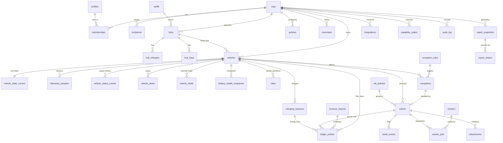

# FleetOS — Domain Model & ERD

> Roadmap task 1.2 · 2026-09-26. Becomes SQL migrations in tasks 2.3 (tenancy), 3.2 (fleet), 3.6–3.7 (money) and Phase 5 (ops). Conventions below apply to every table.

## 1. Conventions

| Rule | Detail |
|---|---|
| Keys | `id uuid primary key default gen_random_uuid()` unless noted |
| Tenancy | Every tenant table has `org_id uuid not null references orgs` + RLS (ADR-0004). Composite indexes lead with `org_id`. |
| Time | `timestamptz` everywhere (UTC); "day" boundaries computed in the org's time zone |
| Money | `bigint` cents (`*_cents`), currency on the org |
| Units | Stored SI: metres (`*_m`), °C, kW, kWh; converted for display (NFR CMP-3) |
| Geo | PostGIS `geography(Point|Polygon, 4326)` |
| Audit columns | `created_at timestamptz default now()`, `created_by uuid` where a user acts; `updated_at` on mutable tables |
| Soft delete | Only `orgs.deleted_at` (30-day window, NFR PRV-4); everything else hard-deletes with the org |
| Enums | Postgres enums for stable sets (statuses, roles); `text` + check constraints for sets likely to grow |
| Writes | Tables marked **worker-only** are written by the worker with the service role; users read them through RLS |
| Substitutes | Columns filled from stand-ins carry a `source` column so data origin is queryable (ties to `SUBSTITUTE(...)` markers) |

## 2. Entity-relationship diagram

## 3. Tables

### 3.1 Tenancy & identity (task 2.3–2.4)

| Table | Key columns | Notes |
|---|---|---|
| `orgs` | `name`, `slug` unique, `timezone`, `currency` (default `USD`), `region` (`na`/`eu`/`cn`), `service_start time`, `service_end time` (default 00:00–24:00), `availability_target numeric` (0.92), `low_soc_threshold numeric` (0.40), `baseline_days int` (28), `is_demo bool`, `city` (task 2.4), `deleted_at` | Settings from `kpis.md` §7 defaults |
| `profiles` | `user_id` PK → `auth.users`, `full_name`, `avatar_url`, `mfa_required bool` | One per user, not tenant-scoped |
| `memberships` | PK (`org_id`, `user_id`), `role` enum `owner/admin/ops/finance/viewer` | RLS helper functions read this (NFR RBAC) |
| `invitations` | `email`, `role`, `token_hash`, `expires_at`, `accepted_at`, `created_by` | Token stored hashed |

### 3.2 Fleet & hubs (task 3.2)

| Table | Key columns | Notes |
|---|---|---|
| `tariffs` | `name`, `source` (`manual`/`urdb`/`arcadia`), `external_id`, `schedule jsonb` (TOU periods → ¢/kWh), `valid_from` | URDB-seeded = `SUBSTITUTE(live_tariffs, static)` |
| `hubs` | `name`, `address`, `location geography(Point)`, `geofence geography(Polygon)`, `exit_buffer_m` (50), `operating_hours jsonb`, `tariff_id` | Geofence hysteresis per `vehicle-states.md` §6 |
| `hub_chargers` | `hub_id`, `label`, `max_kw`, `connector`, `ocpp_charge_point_id` (nullable) | Occupancy inferred until OCPP (preview `charger_telemetry`) |
| `hub_bays` | `hub_id`, `kind` (`cleaning`/`maintenance`/`parking`), `label` | |
| `vehicles` | `vin` (unique per org), `number` ("047", unique per org), `display_name`, `model`, `home_hub_id`, `provider` (`simulator`/`tesla`), `provider_ref`, `lifecycle` (`pending`/`commissioned`/`retired`), `commissioned_at`, `retired_at`, `purchase_price_cents`, `insurance_monthly_cents`, `financing_monthly_cents`, `virtual_key_paired bool`, `telemetry_synced bool` | VIN check-digit validated (PRD FL-5) |
| `vehicle_state_current` | PK `vehicle_id`, `status` enum (7 states), `status_since`, `soc`, `range_m`, `charge_state`, `charge_power_kw`, `charge_limit_soc`, `location geography(Point)`, `heading`, `speed_mps`, `gear`, `odometer_m`, `locked`, `tpms jsonb`, `inside_temp_c`, `outside_temp_c`, `connectivity` (`online`/`asleep`/`offline`), `current_hub_id`, `last_telemetry_at`, `updated_at` | **worker-only**; read by live screens; broadcast on change |
| `telemetry_samples` | PK (`vehicle_id`, `field`, `ts`), `org_id`, `value_num double`, `value_text`, `value_geo geography(Point)` | **worker-only**; `PARTITION BY RANGE (ts)` daily, dropped after 30 days; PK = dedupe key (REL-3) |
| `telemetry_rollup_1m` / `_1h` | PK (`vehicle_id`, `field`, `bucket`), `min`, `max`, `avg`, `last`, `count` | **worker-only**; 13 months / forever |
| `vehicle_status_events` | `vehicle_id`, `from_status`, `to_status`, `at`, `cause_type` (`telemetry`/`ticket`/`exception`/`policy`/`manual`/`platform`), `cause_id`, `detail` | **worker-only**; source of all hour accounting (`kpis.md` §2) |
| `vehicle_alerts` | `vehicle_id`, `name`, `audiences text[]`, `started_at`, `ended_at`, `source` (`telemetry`/`recent_alerts`/`simulator`) | Active while `ended_at is null` |
| `vehicle_holds` | `vehicle_id`, `kind` (`pull_from_service`), `reason`, `created_by`, `released_at`, `released_by` | Manual Maintenance hold (`vehicle-states.md` §5) |
| `battery_health_snapshots` | `vehicle_id`, `taken_at`, `soh_pct`, `capacity_kwh`, `source` (`tesla_specs`/`simulator`) | Monthly job; reports' residual-value section |

### 3.3 Money (tasks 3.6–3.7)

One ledger holds every revenue and cost line; `/api/v1/revenue-lines` and `/api/v1/cost-lines` are filtered views of it.

| Table | Key columns | Notes |
|---|---|---|
| `ledger_entries` | `vehicle_id` (nullable for fleet-level), `hub_id` (nullable), `occurred_on date`, `occurred_at` (nullable), `category` (`gross_ride_revenue`, `platform_fee`, `electricity`, `cleaning`, `maintenance`, `roadside`, `other_variable`, `insurance`, `financing`), `amount_cents` (always positive; sign from category type), `source` (`csv`/`simulator`/`earnings_api`/`tesla_charging`/`depot_inferred`/`ocpp`/`ticket`/`allocation`/`manual`), `source_ref`, `import_id`, `ticket_id`, `charging_session_id` | Unique (`org_id`, `source`, `source_ref`) → idempotent imports. Category → revenue / variable / fixed mapping lives in `packages/domain` (`kpis.md` §3.2) |
| `revenue_imports` | `filename`, `storage_path`, `layout` (`uber_fleet_portal`/`custom`), `mapping jsonb`, `status` (`validating`/`ready`/`imported`/`failed`), `rows_total`, `rows_imported`, `errors jsonb`, `created_by` | CSV importer (PRD FN-6) |
| `rides` | `vehicle_id`, `started_at`, `ended_at`, `distance_m`, `revenue_distance_m`, `fare_cents`, `platform_fee_cents`, `source` (`simulator`/`platform`), `external_id` | Preview `rides`; simulator-filled until a real feed |
| `charging_sessions` | `vehicle_id`, `hub_id`, `started_at`, `ended_at`, `energy_kwh`, `cost_cents`, `source` (`tesla_supercharger`/`depot_inferred`/`ocpp`/`simulator`), `external_id` | Posts `electricity` ledger lines |

### 3.4 Operations (Phase 5)

| Table | Key columns | Notes |
|---|---|---|
| `policies` | `key` ("CLN-02"), `name`, `kind` (`auto_remove`/`min_soc`/`charge_target`/…), `config jsonb`, `enabled` | PRD ST-2 |
| `exception_rules` | `key`, `name`, `condition jsonb` (evaluated by `packages/domain`), `class` (`incident`/`maintenance`/`cleaning`/`charging`/`other`), `severity` (`critical`/`high`/`medium`/`low`), `blocks_service`, `recommended_action jsonb`, `auto_actions jsonb`, `enabled`, `is_system` | System rules seeded per org |
| `exceptions` | `vehicle_id`, `hub_id`, `rule_id`, `type`, `class`, `severity`, `status` (`open`/`assigned`/`in_progress`/`resolved`/`dismissed`), `detected_at`, `location geography(Point)`, `blocks_service`, `expected_downtime_min`, `revenue_at_risk_cents`, `recommended_action jsonb`, `owner_user_id`, `dedupe_key`, `trigger jsonb`, `resolved_at` | Partial unique (`org_id`, `dedupe_key`) where open → no duplicates (PRD EX-2) |
| `sla_policies` | `ticket_type`, `severity`, `response_min`, `resolution_min` | |
| `tickets` | `number` ("SVC-2026-1847", unique per org), `vehicle_id`, `exception_id`, `type` (`cleaning`/`maintenance`/`roadside`/`charging`/`other`), `status` (`open`/`dispatched`/`en_route`/`arrived`/`in_progress`/`completed`/`returned`/`cancelled`), `blocks_service`, `sla_policy_id`, `sla_due_at`, `vendor_id`, `estimated_cost_cents`, `actual_cost_cents`, `description`, `policy_ref`, `detection_source`, `completed_at`, `returned_at` | SLA timer job key `sla-breach:{id}` |
| `ticket_events` | `ticket_id`, `type`, `actor_type` (`user`/`system`/`vendor`), `actor_id`, `at`, `detail jsonb` | Activity log (PRD SV-3) |
| `attachments` | `ticket_id`, `storage_path` (`{org_id}/tickets/{ticket_id}/…`), `content_type`, `size_bytes`, `uploaded_by` | NFR SEC-8 |
| `vendors` | `name`, `categories text[]`, `contact jsonb`, `service_area geography(Polygon)`, `service_radius_m`, `pricing jsonb`, `status` (`active`/`limited`/`inactive`) | Metrics computed, not stored (PRD VN-1) |
| `vendor_jobs` | `vendor_id`, `ticket_id`, `dispatched_at`, `eta_at`, `arrived_at`, `completed_at`, `cost_cents`, `rating`, `tracking_source` (`manual`/`geofence`/`integration`) | Preview `vendor_tracking` when `integration` |

### 3.5 Reporting, integrations & platform

| Table | Key columns | Notes |
|---|---|---|
| `covenants` | `metric`, `operator`, `threshold`, `label` | Default uptime > 94% |
| `report_snapshots` | `period_start`, `period_end`, `version`, `data jsonb`, `grade`, `pdf_path`, `generated_by`, `generated_at` | Immutable once generated (PRD RP-1) |
| `report_shares` | `report_id`, `token_hash`, `recipient`, `expires_at`, `revoked_at`, `view_count`, `last_viewed_at` | NFR SEC-9 |
| `integrations` | `provider` (`tesla`), `region`, `token_type` (`business`/`user`), `scopes text[]`, `status` (`pending`/`connected`/`error`/`revoked`), `vault_secret_id`, `connected_by`, `connected_at`, `last_error` | Secrets only via Vault id (SEC-3) |
| `capability_states` | PK (`org_id`, `capability`), `state` (`live`/`simulated`/`unavailable`), `source`, `updated_at` | Backs `GET /api/v1/capabilities` (ADR-0006) |
| `provider_usage_daily` | PK (`org_id`, `provider`, `day`), `signals`, `data_requests`, `commands`, `wakes`, `specs`, `cost_cents` | Tesla spend caps (NFR OBS-4) |
| `llm_usage_daily` | PK (`org_id`, `day`), `input_tokens`, `output_tokens`, `cost_cents` | Copilot caps (OBS-5) |
| `notifications` | `user_id`, `kind`, `payload jsonb`, `read_at` | Bell (PRD GL-5) |
| `notification_settings` | PK (`org_id`, `user_id`), `channels jsonb` (per severity: in-app/email/slack) | |
| `command_log` | `vehicle_id`, `command`, `params jsonb`, `requested_by`, `approved_by`, `status`, `response jsonb`, `billed` | Phase 7 |
| `audit_log` | `actor_id`, `action`, `target_type`, `target_id`, `at`, `ip`, `detail jsonb` | Append-only: no update/delete policies, 2-year retention (SEC-10) |
| `pgboss.*` | managed by pg-boss | Separate schema (ADR-0010) |

## 4. Row-level security summary

| Group | Read | Write |
|---|---|---|
| Tenancy (`memberships`, `invitations`) | members of the org | `owner`/`admin` |
| Fleet config (`hubs`, `hub_*`, `tariffs`, `vehicles`, `vendors`, `sla_policies`, `policies`, `exception_rules`, `covenants`) | members | `owner`/`admin`; hubs & vendors also `ops` |
| Worker-only (`vehicle_state_current`, `telemetry_*`, `vehicle_status_events`, `vehicle_alerts`, `battery_health_snapshots`, `charging_sessions`, `rides`, `capability_states`, `*_usage_daily`) | members (raw location history: `owner`/`admin`/`ops`, PRV-2) | service role only |
| Operations (`exceptions`, `tickets`, `ticket_events`, `attachments`, `vendor_jobs`, `vehicle_holds`) | members | `owner`/`admin`/`ops` (override rules enforced in functions) |
| Money (`ledger_entries`, `revenue_imports`) | `owner`/`admin`/`finance` | `owner`/`admin`/`finance`; worker for automatic lines |
| Reports (`report_snapshots`, `report_shares`) | `owner`/`admin`/`finance` | same |
| `integrations` | `owner`/`admin` | `owner`/`admin` via server routes |
| `audit_log` | `owner`/`admin` | insert-only via trigger/functions |

## 5. Mapping to requirements

| Requirement | Tables |
|---|---|
| Vehicle-time accounting (`kpis.md` §2) | `vehicle_status_events` |
| Revenue at risk / baselines | `ledger_entries` + `vehicle_status_events` (+ `rides` when live) |
| Vehicle P&L (PRD VD-3) | `ledger_entries` grouped by category |
| Status derivation inputs (`vehicle-states.md` §3) | `vehicle_state_current`, `exceptions`, `tickets`, `vehicle_holds`, `hubs.geofence` |
| Capabilities (ADR-0006) | `capability_states` |
| Substitute provenance (ADR-0012) | `source` columns on `ledger_entries`, `rides`, `charging_sessions`, `tariffs`, `vehicle_alerts`, `battery_health_snapshots`, `vendor_jobs` |
