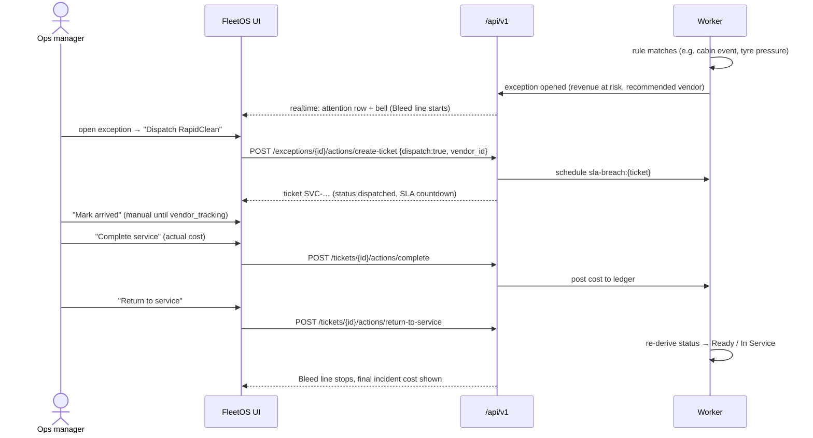
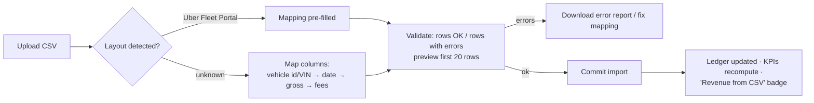

# FleetOS — UX Flows, Navigation & Acceptance Criteria

> Roadmap task 1.5 · 2026-09-26. Flows the MVP didn't have (it only faked them with toasts), the URL map, and acceptance criteria for the 45 PRD stories that had none. Visual language: `design-system.md`. States every screen must handle: `design-system.md` Part 4.

## 1. Navigation & URL map

Every screen and every filter state is deep-linkable (PRD FL-2, notifications link straight to records).

| Route | Screen | Notes |
|---|---|---|
| `/` | Overview | `?period=today\|yesterday\|last_7d` |
| `/fleet` | Fleet list | Filters in query: `?status=charging,cleaning&hub=…&soc_lt=0.4&q=047&sort=-revenue&page=…` |
| `/fleet/[number]` | Vehicle detail (Overview tab) | Uses the vehicle number ("047"), unique per org |
| `/fleet/[number]/operations` · `/service` · `/financials` · `/telemetry` | Vehicle tabs | `?from&to` on telemetry |
| `/exceptions` | Exception queue | `?severity=critical,high&status=open` |
| `/exceptions/[id]` | Exception drawer over the queue | Shareable |
| `/service` | Ticket list | |
| `/service/[number]` | Ticket (SVC-2026-1847) | |
| `/hubs`, `/hubs/[slug]` | Hubs, hub detail | |
| `/vendors`, `/vendors/[slug]` | Vendors | `?category=…` |
| `/financials` | Financials | `?period=mtd` |
| `/financials/imports`, `/financials/imports/[id]` | CSV imports | |
| `/reports`, `/reports/[month]` | Reports (Paper theme) | `?version=` |
| `/settings/{organization,policies,rules,members,integrations,notifications,billing}` | Settings | |
| `/share/[token]` | Public report (Paper theme, no chrome) | |
| ⌘K | Command palette | Jump to vehicle/ticket/page; run "Pull 052 from service"… |

Back navigation restores scroll position and filters. Focus moves to `<main>`'s heading on route change.

## 2. Core flows

### F1 — Detect → dispatch → return to service (the core loop)



UI rules:
- **One primary action per state.** Open → *Dispatch {vendor}*; dispatched → *Mark arrived*; arrived → *Complete service*; completed → *Return to service*. Secondary actions (reassign, escalate, cancel) go in the "More" menu.
- *Return to service* is disabled while a blocking item is open. The tooltip names the item; `owner`/`admin` see *Override…*, which requires a reason.
- If `dispatch` isn't live, the success toast says: "Returned to service in FleetOS. Re-enable car 047 in the Tesla app."

### F2 — First run (new org, simulator-first)

```mermaid
flowchart LR
  A[Sign up / accept invite] --> B{Has an org?}
  B -- no --> C[Create org: name, city, time zone]
  C --> D{Start with…}
  D -- Demo data --> E[Seed Atlas Mobility demo:\n84 simulated Cybercabs, 3 hubs, vendors]
  D -- My fleet --> F[Add first hub on map]
  F --> G[Add vehicles: connect Tesla\nor add VINs manually]
  G --> H[Import revenue CSV (optional)]
  E & H --> I[Overview with checklist:\nhubs ✓ vehicles ✓ vendors ◻ revenue ◻ policies ◻]
```

The checklist stays on Overview until done or dismissed. Demo orgs show a persistent "Demo data (simulated)" banner.

### F3 — Connect Tesla (Phase 4)

1. **Settings → Integrations → Tesla → Connect.** The admin picks the region and account type: **Tesla for Business** (recommended) or **Personal Tesla account**.
2. They're redirected to Tesla (business consent email or OAuth), then back to `/api/v1/integrations/tesla/callback`.
3. The vehicle list appears with per-car status: **Key: not paired / paired** · **Live data: not set up / syncing / live** · firmware.
4. For unpaired cars, **Pair virtual key** shows a QR code and a link (`tesla.com/_ak/<domain>?vin=…`) to open on the phone with the Tesla app, with the instruction "Open on a phone signed in to the Tesla app, near the car". Status refreshes automatically.
5. When paired, FleetOS sends the signed telemetry configuration. The status moves to *syncing* and then *live*, and the car's data badge flips from "Simulated" to live.
6. Errors are shown per car in plain language, e.g. "Firmware 2024.20 is too old for live data. Update the car to 2024.26 or later."

### F4 — Import payout CSV



Re-uploading the same file changes nothing (idempotent on `source_ref`), and the result screen says "0 new rows, 1,284 already imported".

### F5 — Month-end lender report

Reports → **Generate August 2026**. It runs as a background job with progress. The report opens in the **Paper theme** with covenant status at the top, then **Export PDF** or **Share**. The share dialog takes a recipient label and an expiry (default 30 days), creates a link and a *Copy link* button, and adds the share to the report's access list with a *Revoke* button. Regenerating creates version 2; shares keep pointing at the version they were created for.

### F6 — Hub overload mitigation

A hub warning card ("Downtown forecast 112% 5:30–7:15 PM") → **Review plan** → a list of recommendations, each with its impact (+$184) and **Apply** → a confirmation listing the concrete effects ("Route 051, 058, 062… to Tempe after their next trip") → applied. The forecast recomputes and the card updates; the decision is logged in the hub activity. Items that need commands (charge limits) are shown as manual steps until Phase 7.

### F7 — Copilot proposal

Ask → streamed answer with record chips (e.g. `Cybercab 047`, `Downtown Hub`) → a **proposal card** with its actions and projected impact → **Review** opens the same confirmation as F6 → *Confirm* calls the normal API. Viewers see proposals greyed out with the note "Ask an ops user to apply this."

### F8 — Vehicle command (Phase 7)

Action button (e.g. *Start charging*) → confirmation dialog naming the car, the command, the current state and the cost note ("Uses 1 Tesla command") → for risky commands (unlock, remote start) a second approver is required → a pending chip → result toast. Failures read like "Car 082 didn't respond (asleep). Try again when it's online". A non-idempotent command is never retried silently.

## 3. Screen state matrix

| Screen | Loading | Empty | Simulated / not connected | Error | Realtime |
|---|---|---|---|---|---|
| Overview | skeleton tiles + rows | first-run checklist | revenue tiles show source badge; missing revenue → "Awaiting revenue data" | per-card retry | tiles, attention rows, Bleed lines |
| Fleet | table skeleton (10 rows) | "No vehicles. Connect Tesla or add a vehicle" | "Simulated" badge in header; revenue column badge | inline retry | status, SOC, location |
| Vehicle | header + tab skeleton | — | P&L lines show source; telemetry "Simulated" | tab-level error | header facts, timeline |
| Exceptions | list skeleton | "Nothing needs attention. 12 resolved today" | cabin/autonomy exceptions tagged "Simulated source" | retry | new/updated rows |
| Service | ticket skeleton | "No active tickets" | vendor ETA "Entered manually" note | retry | ticket status, SLA timer |
| Hubs | cards skeleton | "Add your first hub" | charger occupancy "Estimated"; tariff "Published rate (URDB)" | retry | occupancy |
| Vendors | cards skeleton | "Invite your first vendor" | tracking "Manual" | retry | — |
| Financials | chart skeletons | "Import a payout CSV to see revenue" | "Revenue from CSV · last import 2 d ago" | retry | — |
| Reports | list skeleton | "Reports appear after your first full month" | incidents "Not yet tracked" | retry | generation progress |
| Settings → Integrations | — | Tesla "Not connected" card | capabilities table (live/simulated/unavailable) | per-integration error | pairing/sync status |

## 4. Acceptance criteria for stories that had none

Format: the story ID, then the criteria that complete it. They're written to be testable (Playwright/unit).

| Story | Acceptance criteria |
|---|---|
| **GL-5** bell | Badge counts unread critical/high exceptions + ticket updates for the user; opening the panel lists newest first with links; "Mark all read" clears the badge; new critical items arrive in ≤ 15 s without reload. |
| **OV-3** charts | Availability chart shows 30 daily points + target band; revenue vs cost shows 7 days; downtime donut shows today's hours by cause (≤ 5 slices); hub margin bars sorted descending; each has a text summary + table view; values match `/kpis/*`. |
| **FL-3** columns/sort | Column chooser persists per user; clicking a numeric header toggles asc/desc with `aria-sort`; sort is server-side and reflected in the URL. |
| **FL-4** export | Export downloads CSV of the current filters (all pages, not just visible rows), money in dollars with 2 dp, header row, filename `fleet-YYYY-MM-DD.csv`; > 10k rows runs async with a download link. |
| **FL-6** row → detail | Clicking or pressing Enter on any row opens `/fleet/{number}` for that vehicle; back returns to the same filters and scroll position. |
| **VD-1** header facts | All facts render from `/vehicles/{id}` + `/kpis/vehicles/{id}`; map shows vehicle marker and hub geofence; stale data shows its age; open issues link to the exceptions. |
| **VD-2** tabs | Each tab has its own URL; direct loading a tab URL works; keyboard arrow keys move between tabs (Radix Tabs). |
| **VD-3** P&L | Lines match `kpis.md` §3.2 categories; contribution, fixed allocations, net and memo downtime cost shown; lines ≥ 25% above fleet average flagged with "+N% above avg"; accounting/economic toggle; each line shows its data source. |
| **VD-4** indicators | Six indicators each show value, fleet average and good/warn/bad flag; preview-dependent ones (cleaning per 1K rides) show source badge or "not tracked". |
| **VD-5** timeline | Shows today's status events, detections, dispatches, arrivals, completions and returns with local times and cause; new events append live; "Earlier" loads previous days. |
| **VD-6** incident impact | For each closed incident today: downtime, service cost, lost revenue (= downtime cost), total, and revenue recovered vs SLA per `kpis.md` E6. |
| **VD-7** telemetry | Field picker (SOC, speed, odometer, charge power, TPMS ×4); ranges 1 h / 24 h / 7 d / custom; auto interval (raw ≤ 6 h, 1 m ≤ 7 d, 1 h beyond); chart + table view; gaps shown as gaps, not zero. |
| **VD-8** create ticket | "Create service ticket" opens a form pre-filled with vehicle and location; created ticket appears in Service and the vehicle timeline. |
| **EX-3** filters | Severity and status filters combine; "Resolved" shows the last 30 days; counts in filter chips match the list; filters in URL. |
| **EX-4** one-step dispatch | From an exception, "Dispatch {recommended vendor}" creates the ticket and dispatch in one request (`create-ticket` with `dispatch:true`); if no vendor is recommended, the vendor ranking list opens instead. |
| **EX-5** rules | Admins can create/edit/disable rules; conditions use a guided builder (field, operator, threshold, duration); a "test against last 24 h" preview shows how many exceptions the rule would have created; system rules can be disabled, not deleted; every change is audited. |
| **SV-1** service KPIs | Four tiles from `/tickets` summary; median response and SLA compliance over trailing 30 days; cost today and revenue protected per `kpis.md` §3.3. |
| **SV-4** attachments | Drag-and-drop or picker; JPEG/PNG/HEIC/PDF ≤ 20 MB; thumbnails; opening uses a short-lived signed URL; upload progress and errors shown; uploads logged in activity. |
| **SV-5** manual ETA/arrival | "Set ETA" and "Mark arrived" record the time and the actor; the vendor job shows `tracking_source = manual`; if vendor tracking is live, these fill automatically and the manual buttons become overrides. |
| **SV-6** cost posting | Completing a ticket with an actual cost creates exactly one ledger line (category from ticket type) linked to the ticket; editing the cost later adjusts that line, never duplicates it. |
| **HB-2** forecast | 24 hourly bars for today (past hours actual, future forecast, visually distinct), capacity line, over-capacity bars hatched + labelled; text summary names the peak hour and %. |
| **HB-3** overload warning | When peak forecast > 100%, a warning card appears on Hubs and in Overview attention with window and %; it links to F6; it clears when the forecast drops ≤ 100%. |
| **HB-5** hub config | Draw geofence on map or set radius; chargers (count, kW), bays by kind, operating hours, tariff (manual or from URDB search); validation for overlapping geofences; changes audited. |
| **VN-2** vendor filter | Category chips with counts; URL reflects selection. |
| **VN-3** add vendor | Form: name, categories, contact, service area (polygon or radius), pricing, SLA terms; vendor appears in rankings for matching categories and areas. |
| **VN-4** ranking | For a vehicle and category, vendors inside their service area are ranked by a documented score (expected ETA, cost, SLA compliance); the score breakdown is visible; vendors marked "limited" are ranked lower. |
| **VN-5** vendor page | Jobs table (paged), SLA compliance and cost trend charts (12 weeks), rating history. |
| **FN-2** weekly charts | Revenue + contribution by week for the selected period; cost breakdown by category with % of total; downtime shown beside costs, not inside them (`kpis.md` #5). |
| **FN-3** insights | Up to 5 insights per period, each naming the vehicle/hub, the gap vs cohort, and the categories explaining ≥ 70% of it, with a link to the P&L. |
| **FN-4** performance table | Sorted Review → Monitor → Strong, then by margin gap; labels per `kpis.md` §3.7; export available. |
| **FN-5** export | CSV of the period's vehicle P&L lines and KPIs; filename includes the period. |
| **FN-6** CSV import | F4 end to end: layout detection, mapping, validation report with row/column errors, idempotent commit, import history with who/when/rows. |
| **RP-2** covenants & grade | Covenant table with value, threshold, pass/at-risk/breach and shape + text; grade with a "How is this calculated?" link to the formula; metrics without a source show "Not tracked". |
| **RP-3** PDF | PDF matches the Paper-theme screen (same numbers), has org name, period, version, generation time and page numbers; ≤ 60 s to generate. |
| **RP-4** share | F5 share flow; link opens without login, read-only, watermarked with the recipient; expired or revoked links show "This report link has expired" with no data. |
| **RP-5** not tracked | Incident sections show "Not yet tracked: connect a data source" when `autonomy_events` is unavailable; simulated in demo orgs with the badge. |
| **ST-1** org settings | Edit name, time zone, currency (read-only after first revenue import), availability target, low-SOC threshold, service window; changes audited; KPIs recompute. |
| **ST-2** policies | List of policies with enable switch and parameters (e.g. CLN-02 confidence threshold, min SOC); each shows which rules use it; changes audited. |
| **ST-3** members | Invite by email with role; pending invites can be resent/revoked; role changes and removals follow RBAC-2 (last owner protected); audited. |
| **ST-5** capabilities | Table of all 9 capabilities with state, source and fallback, and a "How to connect" link per capability. |
| **ST-6** notifications | Matrix severity × channel (in-app, email, Slack); Slack webhook field with "Send test"; per-user settings. |
| **ST-7** billing | Placeholder page stating the current plan and "Billing coming soon"; no dead buttons. |
| **CP-2** proposals | Proposal cards list concrete actions + projected impact; nothing changes until Confirm; confirming calls the same API as manual actions and is audited with "via Copilot". |
| **CP-3** starters & streaming | 4 starter questions based on current data (e.g. the top attention item); first token ≤ 3 s; Stop button; answers keep record chips clickable. |
| **CP-4** honesty | When a tool returns simulated or 501 data, the answer says so in words ("Revenue here is from your CSV import dated…", "Cabin events aren't connected, so I can't tell…"); eval set includes these cases. |
