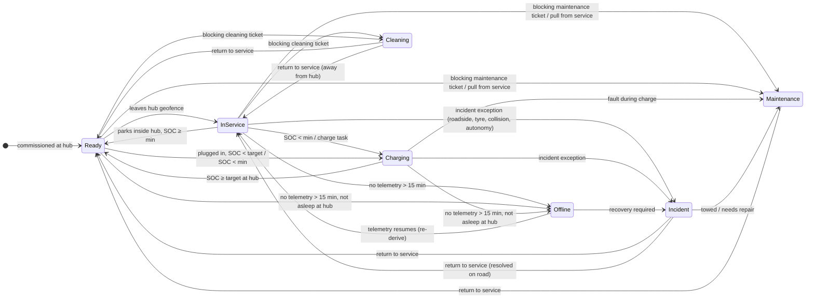

# FleetOS — Vehicle Status State Machine

> Roadmap task 0.3 · Status: **accepted** (recommended defaults, Akshat, 2026-09-26) · 2026-09-26
> Every minute of a commissioned vehicle is in exactly one of 7 operational statuses (`kpis.md` §2). This file defines what each status means, how FleetOS decides it, and what may move a vehicle between statuses. Implemented in `packages/domain/status` (task 3.1) and run by the worker on every ingest (task 3.5).

## 1. Two separate dimensions

| Dimension | Values | Purpose |
|---|---|---|
| **Lifecycle** | `pending` → `commissioned` → `retired` | Whether the vehicle counts in KPIs at all. Only `commissioned` vehicles have an operational status. |
| **Operational status** | In Service · Ready · Charging · Cleaning · Maintenance · Incident · Offline | What the vehicle is doing now; drives availability, downtime and revenue at risk. |

Connectivity (`online` / `asleep` / `offline` from Tesla's roster) is an **input** to status, not a status itself. A Tesla asleep at its hub is Ready, not Offline.

## 2. Statuses

| Status | Meaning | Class (`kpis.md`) | Typical exit |
|---|---|---|---|
| **In Service** | Available and out in the service area: carrying a rider, heading to a pickup, or waiting for a ride | available · earning | Low SOC → Charging; exception → Cleaning / Maintenance / Incident |
| **Ready** | Available, parked at a hub, SOC ≥ policy minimum, no blocking issue | available · idle | Leaves hub → In Service |
| **Charging** | Out of service to charge: plugged in and below charge target, or driving to a hub to charge | planned downtime | Reaches charge target → Ready |
| **Cleaning** | Out of service for interior cleaning (blocking cleaning ticket) | planned downtime | Ticket completed + return to service |
| **Maintenance** | Out of service for diagnostics, repair or scheduled service | unplanned downtime | Ticket completed + return to service |
| **Incident** | Out of service because of a roadside event: breakdown, tyre, collision, autonomy incident, stuck vehicle | unplanned downtime | Recovery ticket completed + return to service |
| **Offline** | No telemetry for longer than the offline threshold and not known to be asleep at a hub; FleetOS can't see the vehicle | unplanned downtime | Telemetry resumes → re-derived |

**Driving empty to a hub** counts toward the reason for the trip: to charge → Charging; to be cleaned → Cleaning. A vehicle returning to its hub with nothing wrong stays In Service until it's parked, then becomes Ready.

## 3. How status is derived

The worker recomputes status for a vehicle whenever new telemetry arrives, a ticket or exception changes, or a user acts. It evaluates these conditions **in precedence order**; the first match wins.

| Precedence | Status | Condition (all inputs are from stable sources unless tagged) |
|---|---|---|
| 1 | **Incident** | an open exception of class `incident` with `blocks_service = true` |
| 2 | **Offline** | last telemetry older than **15 min** and NOT (roster state = `asleep` and last known position inside a hub geofence) |
| 3 | **Maintenance** | an open maintenance ticket with `blocks_service = true`, OR a manual "Pull from service" hold, OR Tesla `service_data` reports the vehicle in service |
| 4 | **Cleaning** | an open cleaning ticket with `blocks_service = true` (e.g. auto-created by policy CLN-02 from a cabin event [P:cabin_events], or manually) |
| 5 | **Charging** | charging state ∈ {Charging, Starting}, OR plugged in at a hub with SOC < charge target, OR navigating to a hub with a charge task |
| 6 | **In Service** | available (none of the above) and outside every hub geofence — *or*, when [P:dispatch] / [P:rides] is live, the platform says it's on a trip or accepting rides |
| 7 | **Ready** | available and inside a hub geofence with SOC ≥ policy minimum |
| — | fallback | available, at a hub, SOC < minimum → **Charging** (a charge task is created) |

Why this order: safety and visibility problems (Incident, Offline) dominate; a blocked vehicle can't also be charging-for-service; "available" is what's left.

**Without preview capabilities**, In Service vs Ready is decided by **location** (outside vs inside a hub). That's accurate for availability (both count as available) but can't tell a car carrying riders from one idling downtown. Utilisation (`H_earn / H_avail`) is labelled "estimated" until [P:dispatch] or [P:rides] is live.

## 4. Transitions

Any status can move to any higher-precedence status the moment its condition becomes true. The diagram shows the common paths, not every legal edge.

## 5. Who can change status

| Actor | Can | Cannot |
|---|---|---|
| **Worker (automatic)** | Everything in §3 from telemetry, tickets, exceptions and policies | Clear a manual hold |
| **Exception rules / policies** | Create blocking exceptions or tickets (e.g. CLN-02 removes a car on a cabin event; low SOC creates a charge task) | Set a status directly; they only create the inputs |
| **Ops user** (`ops`, `admin`, `owner`) | Pull from service (manual Maintenance hold, reason required); Return to service | Return to service while a blocking exception or ticket is open, unless they override with a reason (audited) |
| **Vendor** (Phase 9) | Mark arrived / complete on their job | Change status directly |
| **Robotaxi platform** [P:dispatch] | Tell FleetOS the vehicle's network state | — |

**Return to service** = close or complete the blocking tickets/exceptions (or override with reason) → the worker re-derives status (usually Ready or In Service). With [P:dispatch] live it also re-enables the vehicle on the robotaxi network; without it, the UI says the network-side step is manual.

## 6. Stability rules (avoid flapping)

| Rule | Value | Why |
|---|---|---|
| Debounce | A derived change must hold for **60 s** before it's committed. Incident, manual actions and ticket-driven changes apply immediately. | GPS jitter, brief charge interruptions |
| Geofence hysteresis | Enter hub at radius R, leave at R + 50 m | Cars parked at the hub edge |
| Offline threshold | 15 min without telemetry (Fleet Telemetry); 30 min when only polling is available | Polling is sparser than streaming |
| Clock | Status is timestamped with the telemetry's event time, not ingest time; late events re-derive the affected window | Accurate hour accounting |

## 7. What gets recorded

Every committed change appends a **status event** (`vehicle_status_events`, task 3.2):

| Field | Example |
|---|---|
| `vehicle_id`, `org_id` | — |
| `from_status`, `to_status` | `in_service` → `cleaning` |
| `at` | event time |
| `cause_type` | `telemetry` · `ticket` · `exception` · `policy` · `manual` · `platform` |
| `cause_id` | ticket / exception / rule / user id |
| `detail` | "Policy CLN-02: cabin event conf. 96%" |

The timeline on Vehicle detail (VD-5) and all hour-based KPIs read from these events.

## 8. Mapping to the MVP

| MVP example | Status under these rules |
|---|---|
| 047 "Cleaning · Roosevelt Row · Vendor en route" | Cleaning (CLN-02 ticket, blocks service) |
| 031 "In Service · Sky Harbor T4" | In Service (outside hub, available) |
| 082 "Charging · Downtown Hub · 23%" | Charging (at hub, SOC < minimum) |
| 019 "Maintenance · recurring fault" | Maintenance (diagnostics ticket, blocks service) |
| 063 "Ready · Tempe Hub · 91%" | Ready |
| 074 "Incident · tire pressure · roadside dispatched" | Incident (roadside exception) |
| 052 "Offline · I-10 / 7th Ave · Tow assigned" | **Incident**, not Offline: an open recovery exception outranks lost telemetry (precedence 1 > 2). Offline is for "we can't see it and don't know why". |

## 9. Open questions → resolved 2026-09-26

Resolved with the recommended defaults: **1** yes, an open recovery exception shows Incident; **2** 15 min (streaming) / 30 min (polling-only), revisit with real parking-garage data; **3** only `admin` and `owner` may override an open blocking ticket.

Original questions:

1. **052:** agree that a car with an open recovery exception shows Incident rather than Offline?
2. **Offline threshold** 15 min: too aggressive for cars that lose signal in parking garages?
3. **Return-to-service override:** which roles may override an open blocking ticket (proposed: `admin`, `owner` only)?
