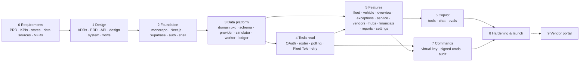

# FleetOS — Product Roadmap & Implementation Plan

> **Status:** Planning complete, Phase 0 not started. Created 2026-09-26.
> **Fresh session?** Read "Handoff" + "Decision log", then open `tasks/todo.md` and resume at the first unchecked task.
> **Rule:** one task = one commit. Push `feature/akshat_implementation` (and offer a PR) only when a phase's exit criteria pass.

## Handoff

FleetOS is an **operations control tower for owners of autonomous (Tesla Cybercab) fleets that are financed as assets**. The MVP (`https://atharvapadhye.github.io/FleetOS/`, identical to this repo's `src/main.js` at `6a32124`) is a static, hard-coded prototype of 9 screens. This plan turns it into a real multi-tenant SaaS: requirements → design → foundation → data platform + simulator → Tesla Fleet API (read) → features screen-by-screen → Copilot → vehicle commands → hardening.

**The core loop the product exists for:**
detect issue → rank by **revenue at risk** → dispatch vendor → track **SLA** → return to service → post cost to the **vehicle's P&L** → roll up into **investor / lender reporting**.

## Decision log (don't relitigate without new information)

| Decision | Chosen | Rejected & why |
|---|---|---|
| Vehicle data source | **Simulator first** behind a `VehicleProvider` adapter; Tesla Fleet API swapped in when access exists | Blocking on Tesla access — no account yet, and Cybercab third-party access is unconfirmed |
| Revenue / ride data | **Simulated rides + CSV payout-statement import** | Tesla Robotaxi payouts API (not public / speculative); own ride-hailing layer (huge scope: rider app, payments, dispatch) |
| Stack | **Next.js (App Router, TS) on Vercel + Supabase (Postgres/PostGIS, Auth, Realtime, Storage, Vault) + Dockerized worker on Fly.io** | AWS (ECS/RDS/Timescale/Redpanda/KMS): 2–3× setup, ~$250–600/mo floor, idle at 84 cars. Vanilla JS: innerHTML templates won't scale to data-driven screens |
| Migration guardrails | Domain logic in framework-agnostic `packages/*`; plain SQL migrations; worker is a container | — keeps a future move of the telemetry hot path to AWS a migration, not a rewrite |
| Move-to-AWS triggers | >1–2k streaming vehicles, customer demands VPC/KMS, or Tesla grants production command access | — |
| Tenancy | **Multi-tenant B2B SaaS**; `org_id` on every row + Postgres RLS from day one | Single-operator tool (hard to sell later); vendor portal deferred to optional Phase 9 |
| Repo | **Monorepo in this repo**: MVP → `prototype/` (still deployed to Pages), `apps/web`, `apps/worker`, `packages/*`, `supabase/` | Separate repo (splits history + design reference); replace-in-place (breaks live demo) |
| Git | Commit per task locally; push per phase | — |
| Copilot LLM | Claude (default `claude-sonnet-5`) with tool-use over RLS-scoped read APIs; verify via `claude-api` skill at build time | — |
| API versioning | **`/api/v1` = data we can source today** (Tesla Fleet API fields, FleetOS-native records, CSV imports). **`/api/v2` = contract-first endpoints for data we don't have yet** (platform rides/earnings, cabin & autonomy events, dispatch, charger/vendor integrations), simulator-backed until a real source is connected. See §3a | One `/v1` + capability flags (versions normally signal breaking changes; accepted trade-off, mitigated by the one-resource-one-version rule) |
| Charts | Recharts (or ECharts for dense time-series), validated with the `dataviz` skill | — |

## 1. What the MVP implements (inventory)

Everything is static, hard-coded HTML strings in `src/main.js`. Only navigation, the fleet search box, and the vehicle-detail drill-in actually work; every other button fires a toast.

| Screen | Envisioned capability | Key data points |
|---|---|---|
| Shell | Org switcher, 9-section nav, live-data indicator, ⌘K Copilot, mobile nav | Org, region, vehicle count, freshness |
| Overview | Fleet KPIs, **needs-attention queue ranked by revenue at risk**, availability trend, revenue vs cost, downtime by cause, margin by hub, fleet health scores, Copilot recommendation | Total/available/earning vehicles, availability % vs target, revenue, contribution, downtime cost, avg SOC |
| Fleet | Vehicle table w/ filters, columns, pagination, export, add vehicle | VIN, status, location, hub, SOC, revenue, contribution, rev/avail-hr, downtime, open issue, next action |
| Vehicle detail | Facts, tabs (Overview/Operations/Service History/Financials/Telemetry), **per-vehicle P&L statement**, KPIs vs fleet avg, event timeline, incident financial impact | Odometer, availability, platform fees, electricity, cleaning, maintenance, insurance, downtime cost, financing |
| Exceptions | Intervention queue by severity, recommended response, est. downtime, revenue at risk, owner/status, rules & automation | Severity, type, detected time/location, vendor, status |
| Service ops | Tickets with **SLA countdown**, vendor/ETA/cost, lost revenue, evidence photos, lifecycle actions, activity log | Detection source, policy (e.g. CLN-02), timestamps |
| Hubs | Chargers/bays/turnaround/electricity price, **hourly capacity forecast**, overload warning, rebalancing actions | Assigned/present vehicles, chargers occupied, $/kWh, utilization % |
| Vendors | Partner network, SLA %, response time, job cost, rating, capacity | Categories: cleaning, detailing, tires, towing, charging |
| Financials | Fleet unit economics, weekly revenue/contribution, cost breakdown, anomaly insight, vehicle ranking | Rev/vehicle, rev/avail-hr, cost/revenue-mile, maintenance reserve |
| Reports | **Monthly investor/lender asset report**, covenant (uptime > 94%), asset health grade, risk grid, PDF export, share | Uptime, contribution/avail-hr, cleaning/1K rides, recovery time, reserve |
| Settings | Tesla Fleet API connect flow (client ID, region, scopes), data mapping; stubs for org, policies, rules, users/roles, notifications, billing | — |
| Copilot | Grounded Q&A + recommendations over fleet data | — |

**Inconsistencies to resolve in Phase 0:** exceptions badge 7 vs 6 listed; overview "76 available / 68 earning" vs fleet mini-stats; "P0A7F" is an OBD code (Tesla exposes its own alert names); vehicle detail always renders 047.

## 2. Tesla APIs — what they expose (verify all in task 0.4)

**Tesla Fleet API** — OAuth 2.0 partner API.
- Auth: authorize `https://auth.tesla.com/oauth2/v3/authorize`, token `https://fleet-auth.prd.vn.cloud.tesla.com/oauth2/v3/token`; partner token (client_credentials) + `POST /api/1/partner_accounts` once per region; public key hosted at `https://<domain>/.well-known/appspecific/com.tesla.3p.public-key.pem`.
- Regional hosts: `fleet-api.prd.na.vn.cloud.tesla.com` (NA/APAC), `fleet-api.prd.eu.vn.cloud.tesla.com` (EU), `fleet-api.prd.cn.vn.cloud.tesla.cn` (CN).
- Scopes: `openid offline_access user_data vehicle_device_data vehicle_location vehicle_cmds vehicle_charging_cmds`.
- Paid per request with rate limits (data, commands, wakes) — polling wakes cars and costs money; prefer Fleet Telemetry.

| Capability | Endpoint / mechanism | FleetOS use |
|---|---|---|
| Roster | `GET /api/1/vehicles`, `/vehicles/{vin}` | Fleet table, online/asleep |
| Full state | `GET /api/1/vehicles/{vin}/vehicle_data?endpoints=charge_state;drive_state;location_data;vehicle_state;climate_state;vehicle_config` | SOC, range, charging, lat/lon, heading, speed, odometer, locks, doors, TPMS, software |
| Fleet status | `POST /api/1/vehicles/fleet_status` | Virtual-key paired? firmware eligibility |
| Alerts / service | `/vehicles/{vin}/recent_alerts`, `/service_data` | Fault exceptions, "in service" status |
| Charging | `/api/1/dx/charging/history`, `/invoice/{id}`, `/vehicles/{vin}/nearby_charging_sites` | Supercharger energy cost |
| **Fleet Telemetry** | `POST /api/1/vehicles/fleet_telemetry_config` → vehicles stream to our self-hosted `teslamotors/fleet-telemetry` (Go, mTLS) | Live SOC, location, speed, gear, odometer, charge state/power, TPMS, alerts, connectivity — without wake/poll cost |
| Commands | Signed via Vehicle Command protocol (`tesla-http-proxy`), requires **virtual key** pairing | Charge start/stop/limit, navigate to hub, lock, flash/honk for vendor, climate |

**NOT exposed (as far as known) → must come from elsewhere:** rides/fares/earnings/platform fees; interior-camera cleanliness events; autonomy incidents/remote-assist events; control of Tesla's Robotaxi dispatch; confirmation that third-party-owned Cybercabs are reachable via Fleet API (needs Tesla business contact).

**Data-source split:** Tesla ≈ vehicle state (~40% of MVP fields). Simulator/CSV ≈ rides & revenue. FleetOS-native ≈ hubs, vendors, tickets, exceptions, policies, cost ledger, reports. Derived ≈ all KPIs.

## 3. Target architecture

```
Browser ── Next.js app (Vercel): UI, route handlers, server actions, Copilot endpoint
              │ supabase-js (user JWT → RLS)          ▲ Realtime (vehicle state, exceptions)
              ▼                                        │
        Supabase: Postgres + PostGIS (partitioned telemetry, ledger, views) · Auth · Storage · Vault
              ▲
        Worker (Docker on Fly.io, Node/TS)
          · provider ingestion (Simulator | Tesla poller | fleet-telemetry dispatcher)
          · normalizer → current state, samples, status events
          · rules engine → exceptions · SLA timers · forecasts · rollups · PDF render
          · tesla-http-proxy (signed commands, Phase 7)
              ▲
        Simulator · Tesla Fleet API + fleet-telemetry (Go, mTLS) · CSV imports · Claude API
```

## 3a. API surface: v1 (available now) vs v2 (needed later)

**Rules**
1. **One resource, one version.** A resource lives in v1 *or* v2, never both, so clients never choose between two copies.
2. **v1 = stable.** Backed by a source we can connect today. No breaking changes without a deprecation cycle.
3. **v2 = contract-first preview** (`x-fleetos-stability: preview`). The schema is defined now in `packages/domain` (zod → OpenAPI). In demo/simulator orgs it returns simulated data with `x-fleetos-data-source: simulated`. In orgs without a real source it returns `501 {"error":"capability_unavailable","capability":"<name>"}`.
4. **No promotion.** When a v2 source goes live, the endpoint stays at v2 and becomes stable. It doesn't move to v1, so clients don't break.
5. **Capability registry.** `GET /api/v1/capabilities` lists which v2 capabilities are live, simulated or unavailable for the current org. The UI shows a "Simulated" badge or a "Connect source" empty state from this.
6. All routes are org-scoped via the user's JWT + RLS; the org id is never passed in the URL.

**v1: sources available now**

| Endpoint | Methods | Source |
|---|---|---|
| `/api/v1/capabilities` | GET | native |
| `/api/v1/vehicles` (filters: status, hub, soc, issue, q, sort, page) | GET, POST | Tesla roster / simulator + native |
| `/api/v1/vehicles/{id}` | GET, PATCH | Tesla state / simulator + native |
| `/api/v1/vehicles/{id}/telemetry?fields&from&to&interval` | GET | Tesla Fleet Telemetry / simulator |
| `/api/v1/vehicles/{id}/status-events` | GET | derived from telemetry + tickets |
| `/api/v1/vehicles/{id}/alerts` | GET | Tesla `recent_alerts` / simulator |
| `/api/v1/vehicles/{id}/charging-sessions` | GET | Tesla charging history + hub tariffs |
| `/api/v1/vehicles/{id}/commands` | POST, GET | Tesla signed commands (enabled in Phase 7) |
| `/api/v1/hubs`, `/hubs/{id}` | GET, POST, PATCH | native |
| `/api/v1/hubs/{id}/occupancy`, `/hubs/{id}/forecast` | GET | derived (vehicle state at hub + SOC projection) |
| `/api/v1/exceptions`, `/exceptions/{id}` | GET, POST, PATCH | rules engine over v1 data + manual |
| `/api/v1/exception-rules` | GET, POST, PATCH, DELETE | native |
| `/api/v1/tickets`, `/tickets/{id}`, `/tickets/{id}/events`, `/tickets/{id}/attachments` | GET, POST, PATCH | native + Storage |
| `/api/v1/vendors`, `/vendors/{id}`, `/vendors/{id}/jobs` | GET, POST, PATCH | native |
| `/api/v1/revenue/imports` | POST (CSV), GET | payout-statement CSV |
| `/api/v1/revenue-lines`, `/api/v1/cost-lines` | GET, POST | CSV + native ledger |
| `/api/v1/kpis/fleet`, `/kpis/hubs`, `/kpis/vehicles/{id}` | GET | derived |
| `/api/v1/financials/pnl?scope=fleet\|hub\|vehicle&period` | GET | derived from ledger |
| `/api/v1/reports`, `/reports/{id}`, `/reports/{id}/pdf` | GET, POST | derived snapshots |
| `/api/v1/policies`, `/api/v1/members`, `/api/v1/notifications` | CRUD | native |
| `/api/v1/integrations/tesla` (+ `/connect`, `/callback`, `/disconnect`) | GET, POST | Tesla OAuth |
| `/api/v1/copilot/chat` | POST (stream) | Claude over v1 tools |

**v2: needed later, simulated until the source exists**

| Endpoint | Methods | Future real source | Screens that need it |
|---|---|---|---|
| `/api/v2/rides`, `/rides/{id}` | GET | Robotaxi platform trip feed (pickup/dropoff, fare, duration, distance) | Fleet revenue, vehicle detail, financials |
| `/api/v2/vehicles/{id}/earnings` | GET | Platform payout API (live gross, platform fee, net) | Overview revenue, vehicle P&L |
| `/api/v2/vehicles/{id}/cabin-events` | GET | Interior camera / cleanliness signals (spill, debris, lost item + confidence) | Exceptions, service tickets, cleaning KPIs |
| `/api/v2/vehicles/{id}/autonomy-events` | GET | Disengagements, remote-assist sessions, incidents | Exceptions, reports (incidents/10K rides) |
| `/api/v2/dispatch/availability` | GET, POST | Robotaxi network control (put vehicle in/out of service, zones) | "Return to service", rebalancing actions |
| `/api/v2/hubs/{id}/chargers/live` | GET | Depot charger telemetry (OCPP / charger vendor API) | Hubs occupancy, capacity forecast accuracy |
| `/api/v2/vendor-jobs/{id}/tracking` | GET, POST (webhook) | Vendor integrations / portal (ETA, geofenced arrival, evidence) | Service SLA countdown, vendor SLA stats |
| `/api/v2/energy/tariffs/live` | GET | Utility time-of-use pricing API | Hub $/kWh, charging cost optimisation |

Until v2 sources are live, the matching v1 figures come from the best available fallback: revenue from CSV imports into the ledger, cleanliness exceptions created manually or from simulator events, and "return to service" as a FleetOS status change only.

Monorepo (pnpm + Turborepo):
```
prototype/            MVP static site (still deployed to Pages)
apps/web/             Next.js app
apps/worker/          ingestion, jobs, simulator runner (Dockerfile)
packages/domain/      types, status state machine, KPI calculators (pure, tested)
packages/providers/   VehicleProvider interface, simulator, tesla
packages/ui/          design tokens + shared components
supabase/             migrations, seed, RLS tests
docs/                 requirements, architecture/ADRs, plans
```

## 4. Phases

Each task: **Goal · Where · Verify**. One commit each (Conventional Commits).

### Phase 0 — Requirements & discovery
Exit: every MVP number has a written formula and a named data source; PRD reviewed by Akshat (+ Atharva).
- **0.1 PRD** — personas (fleet owner/CFO, ops manager/dispatcher, hub lead, finance/investor-relations, org admin; vendor later), jobs-to-be-done, user stories per screen. `docs/requirements/prd.md`. Verify: every MVP screen has ≥3 stories with acceptance criteria.
- **0.2 KPI dictionary** — formulas, units, time windows, targets for availability, rev/avail-hr, contribution & margin, downtime cost, revenue at risk, cost/revenue-mile, SLA compliance, cleaning/1K rides, incidents/10K rides, asset health grade, maintenance reserve. Resolve the MVP inconsistencies. `docs/requirements/kpis.md`. Verify: MVP overview numbers reproducible from a worked example.
- **0.3 Vehicle status state machine** — In Service, Ready, Charging, Cleaning, Maintenance, Incident, Offline; transitions, triggers, who/what can cause each. `docs/requirements/vehicle-states.md` (mermaid stateDiagram).
- **0.4 Data-source matrix + Tesla verification** — every field → Tesla endpoint/telemetry field | simulator | CSV | native | derived, and tagged **v1** (source available now) or **v2** (source needed later) per §3a. Re-verify Tesla endpoints, scopes, telemetry fields, pricing, rate limits against developer.tesla.com. `docs/requirements/data-sources.md`.
- **0.5 NFRs** — tenancy, RBAC matrix, token/key security, audit, freshness (live ≤ 15 s), retention (raw telemetry 30 d, rollups forever), a11y (WCAG 2.2 AA), browser support, costs. `docs/requirements/nfr.md`.

### Phase 1 — Design
Exit: ERD, API contract, provider interface, design tokens reviewed.
- **1.1 Architecture + ADRs** — the decisions above as ADR files. `docs/architecture/`.
- **1.2 Domain model / ERD** — orgs, memberships, hubs, chargers, bays, vehicles, vehicle_state_current, telemetry_samples (daily partitions), vehicle_status_events, rides, revenue_lines, cost_lines, exception_rules, exceptions, tickets, ticket_events, vendors, vendor_services, vendor_jobs, attachments, policies, report_snapshots, integrations, command_log, audit_log. `docs/architecture/erd.md` (mermaid erDiagram).
- **1.3 API contract** — v1 + v2 OpenAPI (§3a) generated from zod schemas, capability registry, 501 `capability_unavailable` shape, preview/data-source headers, Realtime channel list, `VehicleProvider` TS interface + normalized `VehicleSnapshot` (Tesla-shaped). `docs/architecture/api.md` + `openapi.yaml`.
- **1.4 Design system** — `frontend-design` → `ui-ux-pro-max`: extract MVP tokens (dark palette, DM Sans/Manrope, spacing, radii, status colors) and component inventory (Metric, Card, StatusPill, Bar, Sparkline, DataTable, Timeline, Modal, Toast, CommandPalette). `docs/design/design-system.md`.
- **1.5 UX flows** — states the MVP lacks: loading/empty/error, filters, detail tabs, exception→ticket→dispatch→return flow, command confirmation, CSV import mapping. `docs/design/flows.md`.

### Phase 2 — Foundation
Exit: on a Vercel preview URL you can sign in, create/switch org, and navigate the empty shell; RLS isolation tests pass in CI; Pages still serves the prototype.
- **2.1 Monorepo + prototype move** — move MVP to `prototype/`, pnpm workspaces + Turborepo, update `deploy-pages.yml` to build `prototype/`. Verify: `pnpm --filter prototype build` produces identical `dist/`.
- **2.2 Next.js app** — `apps/web` (App Router, TS strict, Tailwind, shadcn/ui), tokens in `packages/ui`; ESLint, Prettier, Vitest, Playwright; GitHub Actions CI (lint, typecheck, test).
- **2.3 Supabase baseline** — local CLI stack, migrations for orgs/memberships/profiles, `auth.org_ids()` helper, RLS policies, pgTAP isolation tests.
- **2.4 Auth + orgs + roles** — magic link + Google; roles owner/admin/ops/finance/viewer; middleware route protection; org switcher.
- **2.5 App shell** — sidebar, header, 9 routes, ⌘K palette stub, mobile nav, ported from MVP look.
- **2.6 Env + observability** — zod env schema, Sentry, structured logs, Vercel previews, Supabase remote project.

### Phase 3 — Data platform & simulator (API implementation, part 1)
Exit: simulator runs 24 h for 84 Cybercabs across 3 Phoenix hubs; state, rides, costs, status events land in Postgres; KPI views match hand-calculated fixtures.
- **3.1 `packages/domain`** — types, status state machine, KPI calculators (unit tests from 0.2 worked examples).
- **3.2 Vehicle/hub schema** — hubs, chargers, bays, vehicles, vehicle_state_current, telemetry_samples (partitioned), status_events + RLS.
- **3.3 `VehicleProvider` interface** — `listVehicles`, `getSnapshot`, `streamTelemetry`, `sendCommand`; contract tests any provider must pass.
- **3.4 Simulator provider** — seeded RNG; Phoenix geography; SOC drain/charge; trips with fares; events (cleanliness, tire pressure, fault, breakdown, offline); emits Tesla-shaped payloads.
- **3.5 Worker ingestion** — `apps/worker` Dockerfile; normalize → upsert current state, append samples, derive status events; Realtime broadcast; deploy to Fly.
- **3.6 Rides & revenue + CSV import** — rides, revenue_lines; payout CSV importer with column mapping + validation report.
- **3.7 Cost ledger** — hub tariffs → energy cost; vendor job costs; per-vehicle allocations (insurance, financing, platform fees) → cost_lines.
- **3.8 v1 read APIs + rollups** — `/api/v1` fleet list (filter/sort/paginate), vehicle detail, KPI materialized views refreshed by worker; Realtime subscriptions.
- **3.9 v2 preview APIs** — `/api/v2` routes from §3a served by the simulator in demo orgs, 501 elsewhere; `/api/v1/capabilities`; contract tests assert both behaviours.

### Phase 4 — Tesla Fleet API (read-only)
Exit: a real Tesla (any model) connected via OAuth appears in the fleet within 60 s with live SOC/location via Fleet Telemetry; without a car, recorded-fixture contract tests pass.
- **4.1 Registration** — EC P-256 keypair, public key at `/.well-known/appspecific/com.tesla.3p.public-key.pem`, partner registration script per region.
- **4.2 OAuth** — connect → authorize → callback → server-side token exchange; refresh tokens in Supabase Vault; refresh job; disconnect.
- **4.3 `TeslaProvider` read** — roster sync, `vehicle_data` polling with request budget & sleep awareness (never wake just to poll), `fleet_status`, `recent_alerts`, charging history; passes provider contract tests.
- **4.4 Fleet Telemetry** — deploy `teslamotors/fleet-telemetry` (Fly, TLS), per-VIN `fleet_telemetry_config`, dispatcher → worker normalizer (same path as simulator).
- **4.5 Integrations page** — real connection status, region, scopes, per-vehicle telemetry health & errors.

### Phase 5 — Features (vertical slices, each UI + API + tests)
Exit: every MVP screen is live-data driven with working interactions; Playwright E2E covers the core loop.
- **5.1 Fleet list** — filters (status/hub/SOC/profit/issue), column chooser, pagination, CSV export, add vehicle.
- **5.2 Vehicle detail** — facts, map, 5 working tabs, telemetry charts, event timeline, economics statement.
- **5.3 Overview** — KPI strip, needs-attention queue, charts (dataviz-validated), live updates.
- **5.4 Exceptions engine** — declarative rules (condition → severity → recommended action), revenue-at-risk calc, dedupe, lifecycle, UI filters, rules editor in Settings.
- **5.5 Service tickets** — create from exception, SLA policies, countdown timers (worker jobs), actions (assign, escalate, arrived, complete, return to service), evidence uploads (Storage), activity log.
- **5.6 Vendors** — directory CRUD, categories, PostGIS service areas, pricing, SLA stats from jobs, dispatch ranking (ETA × cost × SLA).
- **5.7 Hubs** — capacity model, live charger/bay occupancy, hourly utilization forecast from SOC projections, overload alerts, rebalancing recommendations with Apply.
- **5.8 Financials** — fleet & vehicle P&L from ledger, period picker, cost breakdown, cohort anomaly insights, export.
- **5.9 Reports** — monthly snapshot job, sections, asset health grade, covenant thresholds, PDF render in worker (Playwright), share link.
- **5.10 Settings** — organization, fleet policies (min SOC, cleanliness CLN-02…), users & invites, notifications, billing stub.
- **5.11 Notifications** — in-app bell, email, Slack webhook for critical exceptions.

### Phase 6 — FleetOS Copilot
Exit: golden-question eval ≥ 90% grounded answers on simulator seed; every recommendation is a confirmable action.
- **6.1 Tool layer** — `get_fleet_kpis`, `list_exceptions`, `get_vehicle_economics`, `forecast_hub_capacity`, … executed with the user's JWT (RLS).
- **6.2 Chat UI** — ⌘K, streaming, record citations, proposed-action cards.
- **6.3 Evals** — golden questions + regression run in CI.

### Phase 7 — Vehicle commands (write path)
Exit: with a paired test vehicle (or simulator), a dispatcher can start charging with confirmation; every command is audited.
- **7.1 Virtual-key pairing** — pairing link flow + per-vehicle key status.
- **7.2 Signed commands** — `tesla-http-proxy` in worker; private key in Vault (KMS if moved to AWS).
- **7.3 Command policy** — RBAC, confirmations, dual approval for risky commands, rate limits, command_log, audit_log.
- **7.4 Wire actions** — charge start/stop/limit, navigate to hub, lock, flash/honk for vendor.

### Phase 8 — Hardening & launch
Exit: security sweep clean of high/critical; 1,000-vehicle simulator load passes; pilot tenant onboarded.
- **8.1 Security** — `security-sweep`, RLS pen tests, secrets audit.
- **8.2 Performance** — 1,000-vehicle load test; telemetry retention + rollups; query budgets.
- **8.3 Accessibility & responsive** — `web-design-guidelines` audit.
- **8.4 Onboarding** — org wizard, hub setup, CSV imports, seeded demo tenant.
- **8.5 Ops** — runbooks, backups, uptime monitoring, pilot; decide prototype's future (keep as marketing demo).

### Phase 9 — (optional) Vendor portal
Vendor logins, job accept/decline, ETA, geofenced arrival, photo evidence, invoices.

## 5. Mental map



Phase 4 can run in parallel with Phase 5 because the simulator stands in for Tesla.
